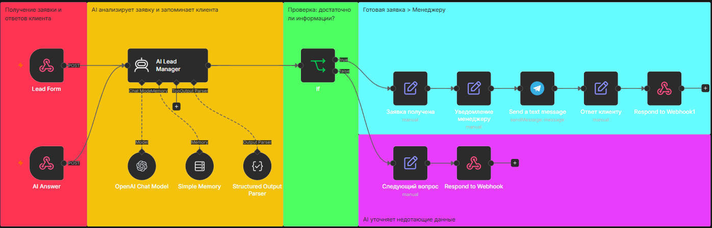

# 🤖 AI Lead Manager

AI-система для автоматической обработки входящих заявок с сайта.

Она принимает заявку, анализирует данные, уточняет недостающую информацию у клиента и передаёт менеджеру уже готовое структурированное обращение.

Проект создан как демонстрационный кейс автоматизации продаж и обработки лидов с помощью n8n + OpenAI + Telegram.

## 🎬 Демонстрация

▶️ YouTube: [Посмотреть работу AI Lead Manager](https://youtu.be/PkcLQGkhyR0)

## 💼 Какую задачу решает

Во многих компаниях менеджеры тратят время на первичный сбор информации:

- кто клиент;
- из какой он компании;
- что ему нужно;
- как с ним связаться.

AI Lead Manager берёт этот этап на себя.

Система автоматически:

- принимает заявку с сайта;
- анализирует введённые данные;
- определяет, хватает ли информации;
- задаёт уточняющие вопросы;
- сохраняет контекст диалога;
- проверяет контактные данные;
- передаёт менеджеру готовую заявку в Telegram.

## ⚙️ Как работает

1. 📝 Клиент отправляет заявку с сайта
2. 🧠 AI анализирует данные и запоминает контекст
3. 🔎 Система проверяет, достаточно ли информации
4. ❓ Если данных не хватает - AI задаёт уточняющий вопрос
5. 💬 Клиент отвечает, а AI продолжает тот же диалог
6. ✅ Когда заявка полностью собрана - менеджер получает готовую информацию в Telegram

## 🧠 Какие данные собирает AI

Система может определить и сохранить:

- имя клиента;
- компанию;
- задачу;
- телефон;
- email;
- Telegram.

Для завершения заявки достаточно одного корректного способа связи.

Если контакт выглядит некорректно, AI не считает заявку завершённой и просит пользователя указать нормальный телефон, email или Telegram.

## 🔄 Пример сценария

Клиент отправляет неполную заявку.

AI видит, что не хватает контакта, и задаёт уточняющий вопрос.

Клиент отвечает:

Мой Telegram @example_user

AI сохраняет ответ в контексте текущей сессии, повторно проверяет заявку и, если всех данных достаточно, передаёт её менеджеру.

## 🛠 Стек

- n8n - логика автоматизации
- OpenAI - анализ заявок и диалог с клиентом
- Webhooks - получение формы и последующих ответов
- Simple Memory - сохранение контекста диалога
- Structured Output Parser - структурированные данные заявки
- Telegram Bot API - уведомления менеджера
- HTML / JavaScript - интерфейс формы на сайте
- Traefik - HTTPS и обработка CORS для webhook-запросов

## 📁 Workflow

В репозитории находится очищенная публичная версия n8n workflow.

Её можно импортировать в n8n и подключить собственные credentials и webhook-настройки.

Для запуска потребуются собственные:

- OpenAI credentials;
- Telegram Bot credentials;
- адрес сайта;
- webhook endpoints.

Credentials, реальные webhook-адреса, Telegram Chat ID и данные рабочей инфраструктуры намеренно не публикуются.

## 🔒 Безопасность

Репозиторий содержит демонстрационную публичную версию проекта.

Из workflow удалены или заменены:

- API credentials;
- Telegram credentials;
- личный Chat ID менеджера;
- реальные webhook paths;
- данные рабочей инфраструктуры.

## 👨‍💻 Автор

Проект разработан как часть моего портфолио по AI-автоматизации бизнес-процессов.

Специализация: разработка AI-агентов и автоматизаций на n8n.
